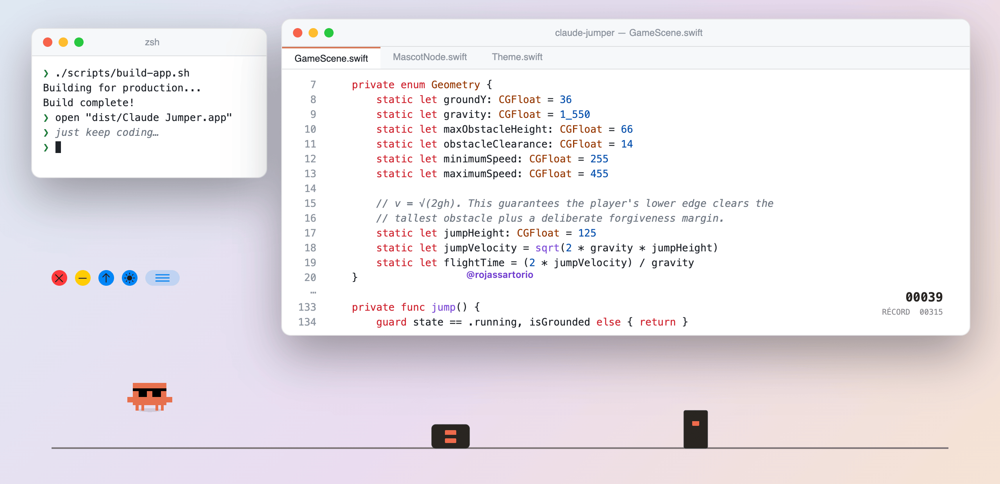

<div align="center">

<picture>
  <source media="(prefers-color-scheme: dark)" srcset="docs/hero-dark.png">
  
</picture>

# Claude Jumper

**An endless runner that lives on top of your desktop.**

Press <kbd>Space</kbd> in *any* app (your editor, your terminal, a fullscreen video) and the little guy jumps.<br>
Think Chrome's offline dino, except it's native, it floats above every window, and it never steals your focus.


</div>

---

## ✨ Features

- **Global space bar.** It *observes* the key, it doesn't swallow it: your app still gets every keystroke.
- **Click-through track.** Clicks go straight to whatever is behind it. Only the tiny control bar catches the mouse.
- **Always on top.** The track sits at the status-bar window level, so it stays visible over fullscreen apps and on every Space.
- **Two themes**, *on light* and *on dark* wallpapers. The window stays 100 % transparent either way, and your choice is remembered.
- **Recording mode** hides the controls, so your OBS capture is just the game.
- **Local high score.** No accounts, no leaderboard, no network.
- **Zero dependencies**: AppKit + SpriteKit + SwiftPM, about 850 lines of Swift. No `.xcodeproj` in sight.

## 🚀 Quick start

You need **macOS 14 Sonoma or later** and **Xcode 16+** (the Swift 6 toolchain).

```bash
git clone https://github.com/devsart95/claude-jumper.git
cd claude-jumper
./scripts/build-app.sh
open "dist/Claude Jumper.app"
```

On first launch macOS asks for **Accessibility** permission, which a global key monitor needs. You can manage it in
*System Settings → Privacy & Security → Accessibility*.

> [!TIP]
> **Code signing:** `build-app.sh` uses your first *Apple Development* identity if you have one, and signs ad-hoc otherwise.
> With an ad-hoc signature macOS forgets the Accessibility grant on every rebuild. To pick a specific identity:
> `CODE_SIGN_IDENTITY="Apple Development: you@example.com (TEAMID)" ./scripts/build-app.sh`

## 🎮 Controls

| Input | What it does |
|---|---|
| <kbd>Space</kbd> | Start · jump · resume · retry. It works from any app. |
| 🔴 red button | Quit |
| 🟡 yellow button | Hide the track (bring it back from the menu bar) |
| 🔵 arrow button | Jump (for when you're mouse-only) |
| 🔵 sun / moon button | Toggle *on light* / *on dark* theme |
| ☰ handle | Drag to move the whole track |
| 🏃 menu bar icon | Show · recording mode · pause · theme · reset high score · quit |

The in-game UI speaks Spanish 🇵🇾. Your pocket dictionary:

| On screen | Means |
|---|---|
| `ESPACIO PARA SALTAR` | press space to jump |
| `PAUSA · ESPACIO PARA SEGUIR` | paused, space to continue |
| `OUCH · ESPACIO PARA REINTENTAR` | you crashed, space to retry |
| `RÉCORD` | high score |

## ⚙️ Configuration

Everything lives in `UserDefaults` under `py.devsar.claudejumper`:

```bash
# Put your own handle on the track (an empty string hides it)
defaults write py.devsar.claudejumper signature "@you"

# Start in a specific theme: lightBackground | darkBackground
defaults write py.devsar.claudejumper gameTheme lightBackground
```

The high score is stored under `highScore`. Resetting it from the menu is friendlier than `defaults delete`.

## 🧪 The physics, for nerds

The jump isn't tuned by feel. It's derived from projectile motion:

```swift
// v = √(2gh). This guarantees the player's lower edge clears the
// tallest obstacle plus a deliberate forgiveness margin.
static let jumpHeight: CGFloat = 125
static let jumpVelocity = sqrt(2 * gravity * jumpHeight)
static let flightTime = (2 * jumpVelocity) / gravity
```

| Quantity | Value |
|---|---|
| Gravity *g* | 1,550 pt/s² |
| Jump height *h* | 125 pt (the tallest obstacle is 64 pt) |
| Takeoff velocity √(2gh) | ≈ 622.5 pt/s |
| Airtime 2v/g | ≈ 0.803 s |
| Run speed | 255 → 455 pt/s, +1.25 pt/s per point |
| Jump length | ≈ 205 pt at start, ≈ 365 pt at top speed |
| Score | 10 points per second, so top speed arrives at 160 points (16 s) |

A few more details:

- **Obstacle spacing comes from the physics.** Each gap is at least 88 % of the current jump length, plus 0.30–0.72 s of jitter, so the gaps stretch as the speed climbs.
- **No tunneling.** The frame delta is clamped to 1/20 s, so a hiccup can't teleport you through an obstacle.
- **Forgiving hitboxes.** Collisions are axis-aligned boxes inset a few points, so you're a little thinner than you look.
- **Crisp pixels.** The sprite renders with nearest-neighbor filtering, so there's no blurry pixel art.

## 🔒 Privacy

Reasonable question: *is this a keylogger?* No.

- One global monitor compares `event.keyCode == 49` (space) and ignores everything else.
- Nothing is logged, stored or sent anywhere. There's no networking code at all.
- The only things persisted are `highScore`, `gameTheme` and `signature`.

Don't trust a README: `grep -rn "keyCode" Sources/` and read the ~850 lines yourself.

## 🎥 Recording

- In OBS, use **Display Capture**. Window or app capture leaves the track out.
- Turn on **Recording mode (no controls)** from the menu bar icon to hide the buttons and the handle.
- To check that the track stays above fullscreen apps, run this with the game open:

```bash
swift scripts/verificar-overlay.swift   # puts a test window in fullscreen; exits 1 if the track disappears
```

## 🗂 Project layout

```
claude-jumper/
├── Package.swift                  # SwiftPM, no .xcodeproj
├── Sources/ClaudeJumper/
│   ├── main.swift                 # NSApplication bootstrap
│   ├── AppDelegate.swift          # global key monitor, permission polling, menu bar
│   ├── FloatingGameWindow.swift   # transparent click-through overlay + control bar
│   ├── GameScene.swift            # game loop: physics, spawning, collisions, score
│   ├── MascotNode.swift           # pixel sprite + shadow
│   └── Theme.swift                # light / dark palettes
├── Assets/                        # sprite + app icon (Icons8, see Credits)
├── scripts/
│   ├── build-app.sh               # swift build → .app bundle → codesign
│   └── verificar-overlay.swift    # fullscreen overlay check
└── docs/                          # README images
```

## 🙏 Credits

- Pixel mascot sprite and app icon by **[Icons8](https://icons8.com)**.
- Built by DevSar in Paraguay 🇵🇾. Signed on the track as `@rojassartorio`.

> [!NOTE]
> Claude Jumper is an unofficial fan project. It is not affiliated with, endorsed by, or sponsored by Anthropic.
> Claude is a trademark of Anthropic, PBC.

## 📄 License

The source code is released under the [MIT License](LICENSE).

The files in `Assets/` (`clawd-sunglasses.png` and `ClaudeJumper.icns`) come from Icons8. They are **not** covered by the MIT
license; their use is governed by the [Icons8 license](https://icons8.com/license).
